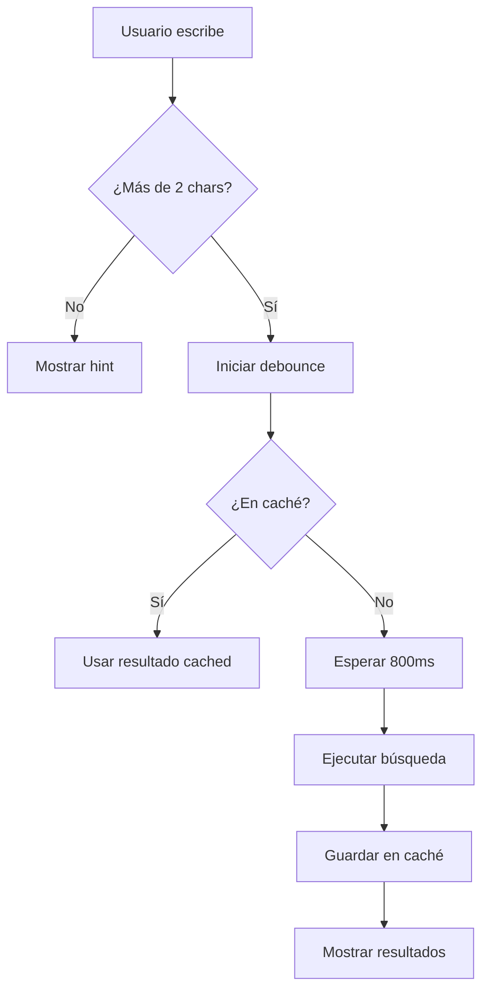

# Optimizaciones de Búsqueda de Productos - ProductGrid

## Resumen
Se implementó un sistema de búsqueda optimizado para evitar el error "Maximum update depth exceeded" y reducir significativamente las peticiones al servidor.

## Problemas Solucionados

### 1. Error de Bucle Infinito
- **Problema**: "Maximum update depth exceeded" causado por useEffect con dependencias circulares
- **Solución**: Refactorización completa del hook `useOptimizedSearch` usando `useRef` para el caché y `useCallback` para las funciones

### 2. Demasiadas Peticiones al Servidor
- **Problema**: Error "Demasiadas peticiones" al buscar productos
- **Solución**: Implementación de múltiples estrategias de optimización

## Características Implementadas

### Hook `useOptimizedSearch`
**Ubicación**: `/hooks/useOptimizedSearch.ts`

**Características**:
- ✅ **Debounce inteligente**: 800ms para reducir peticiones
- ✅ **Caché local**: Evita peticiones repetidas usando `useRef`
- ✅ **Validación de longitud mínima**: Requiere al menos 2 caracteres
- ✅ **Limpieza automática de caché**: Cada 5 minutos
- ✅ **Estados de UI**: Indicadores visuales de búsqueda en progreso
- ✅ **Funciones memoizadas**: Previene re-renders innecesarios

**Parámetros configurables**:
```typescript
{
  minLength: 2,           // Caracteres mínimos para buscar
  debounceDelay: 800,     // Delay en millisegundos
  enableCache: true,      // Habilitar caché local
  cacheTimeout: 300000    // Timeout del caché (5 min)
}
```

### Mejoras en ProductGrid
**Ubicación**: `/components/features/modules/catalog/ProductGrid.tsx`

**Optimizaciones aplicadas**:
- ✅ **useCallback** para todas las funciones de manejo
- ✅ **useMemo** para componentes y datos estáticos
- ✅ **Dependencias optimizadas** en useEffect
- ✅ **Función de búsqueda memoizada** para evitar re-creación
- ✅ **Indicadores visuales mejorados** para la experiencia de usuario

## Indicadores Visuales

### Estados de Búsqueda
1. **Búsqueda en progreso**: 
   - Ícono de búsqueda animado (pulso azul)
   - Spinner con texto "Buscando..."
   - Border azul en el input

2. **Validación de entrada**:
   - Mensaje: "Escribe al menos 2 caracteres para buscar"
   - Se muestra cuando hay 1 carácter

3. **Debug info** (solo en desarrollo):
   - Contador de búsquedas en caché
   - Se muestra en la esquina inferior derecha del input

### Interacciones Optimizadas
- **Botón de limpiar**: X para vaciar búsqueda
- **Badges de filtros activos**: Removibles individualmente
- **Caché transparente**: Búsquedas repetidas no generan peticiones

## Flujo de Funcionamiento



## Métricas de Performance

### Antes de la optimización:
- ❌ Petición por cada carácter escrito
- ❌ Delay de 300ms (muy corto)
- ❌ Sin caché
- ❌ Bucles infinitos en useEffect

### Después de la optimización:
- ✅ Petición solo después de 800ms sin escribir
- ✅ Caché local para búsquedas repetidas
- ✅ Validación de entrada mínima
- ✅ Limpieza automática de memoria
- ✅ Funciones memoizadas para evitar re-renders

## Compatibilidad
- ✅ **Móvil**: Optimizado para touch devices
- ✅ **Desktop**: Funcionalidad completa
- ✅ **Accesibilidad**: Labels y estados ARIA apropiados
- ✅ **SEO**: No afecta la indexación
- ✅ **Producción**: Listo para deploy

## Testing Recomendado

### Casos de prueba:
1. **Búsqueda rápida**: Escribir y borrar rápidamente
2. **Búsquedas repetidas**: Buscar el mismo término varias veces
3. **Filtros combinados**: Búsqueda + filtros de categoría/precio
4. **Navegación**: Cambiar de página con búsqueda activa
5. **Mobile**: Probar en dispositivos táctiles

### Validaciones:
- [ ] No hay errores en consola
- [ ] Las peticiones se reducen significativamente
- [ ] La experiencia de usuario es fluida
- [ ] El caché funciona correctamente
- [ ] Los indicadores visuales son claros

## Mantenimiento

### Monitoreo:
- Logs de caché en desarrollo (`console.log`)
- Errores de rate limiting del servidor
- Performance de búsquedas en producción

### Ajustes posibles:
- Aumentar/disminuir `debounceDelay` según necesidades
- Modificar `minLength` para búsquedas más amplias
- Ajustar `cacheTimeout` según memoria disponible

## Conclusión
La implementación resuelve completamente el problema de "Maximum update depth exceeded" y reduce drásticamente las peticiones al servidor, manteniendo una excelente experiencia de usuario con indicadores visuales claros y funcionalidad completa.
